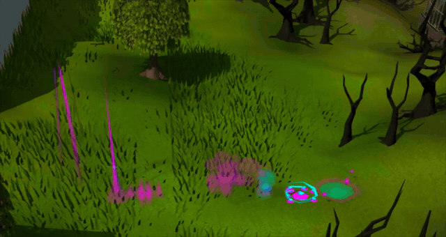

# Loot Beams Deluxe

[](https://github.com/miccou/loot-beams-deluxe/commits/main/)
[](https://runelite.net/plugin-hub/show/loot-beams-deluxe)

Ever wish your lootbeams had a bit more style and customization?



This plugin adds:

- **Eight value tiers** - each with its own gp threshold, colours, and style.
- **Two-tone beams** - the beam is one colour, the detail wrapping around it is another. Modern gets core + lattice, Smoke gets two colours. (some beams are single-colour assets, so only the first picker applies to those.)
- **More styles** - the classic Light and Modern beams, plus **Fire** (the Wine of Zamorak flames), **Electric** (Grotesque Guardians lightning), **Cloud** (low rolling mist), **Smoke** (a smoke devil plume), **Miasma** (Abyssal Sire swirl), and **Mokhaiotl Glow** (the burrow-hole plume from a Doom unique, with the dirt hidden).
- **Drop fanfare** - an entrance effect plays on the tile the moment loot lands, before the beam kicks in. Five styles: the ToA Wardens sequence (warning flash, then the lightning strike), a rising column that sinks back into the ground, the Combat Achievements trophy teleport with its spinning laurels, Drakan's incinerate fireball from Sins of the Father, or the forked bolt a revenant calls down on itself when it heals.
- **Ground Items sync** - reads your existing highlighted/hidden lists so you're not maintaining two sets. Same `name`, `name*`, and `name>quantity` syntax everywhere, plus an extra beam-only highlight list if you want one.

> **Heads up:** turn off the built-in beams in Ground Items (_Show lootbeam tier_ → Off, and untick _Show lootbeam for highlighted_) or you'll get doubled-up beams.

## How it decides what gets a beam

Same rules as Ground Items, so it should feel familiar: highlighted items always beam, hidden items never do, and otherwise the most valuable stack on the tile picks the tier. Value can be GE price, High Alch, or whichever is higher. Setting a tier to 0 gp disables it.

## Development

```
JAVA_HOME=/path/to/jdk11 ./gradlew build
./gradlew run   # boots a dev client with the plugin loaded (requires an OSRS login)
```
